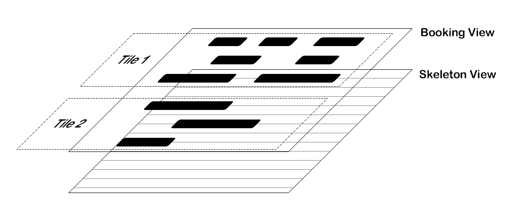

# README

A reservation data render library base on canvaskit-wasm.

## Architecture

## BenchMark

| Cell Number           | FPS | Memory |      Platform      |
|:----------------------|:---:|:------:|:------------------:|
| 1,000*1,000=1,000,000 | 66  | 238MB  | Apple M1 Pro 16 GB |
| 2,000*2,000=4,000,000 | 66  | 918MB  | Apple M1 Pro 16 GB |
| 3,000*3,000=9,000,000 | 66  | 2051MB | Apple M1 Pro 16 GB |
| 20,000*365=7,300,000  | 66  | 1685MB | Apple M1 Pro 16 GB |
| 500*10,000=5,000,000  | 50  | 1169MB | Apple M1 Pro 16 GB |

> performance limited by Memory, when it over 2GB(about 9M data), the FPS will become unstable and app may crash.

> having too many data in one row will reduce FPS.

> when data reduce to 1,500*1,500 = 2,250,000(random half data of 3,000*3,000 = 9,000,000), FPS increase to 125
